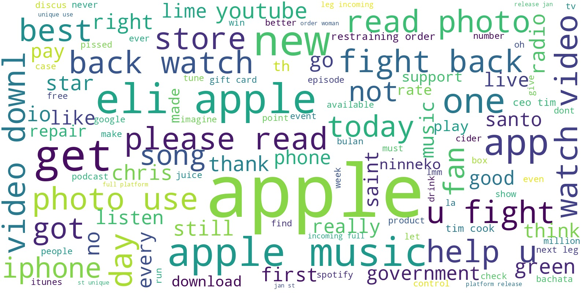
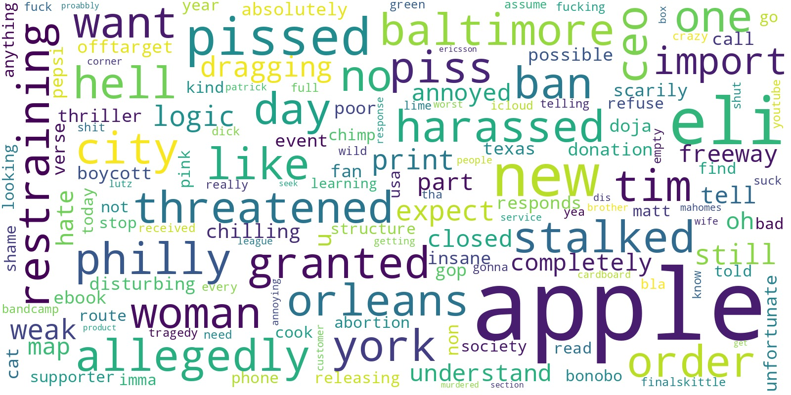
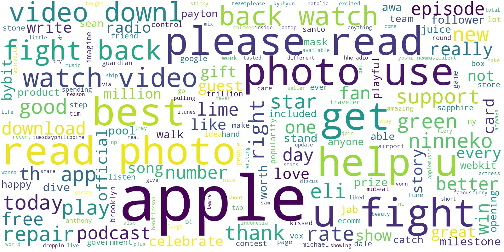
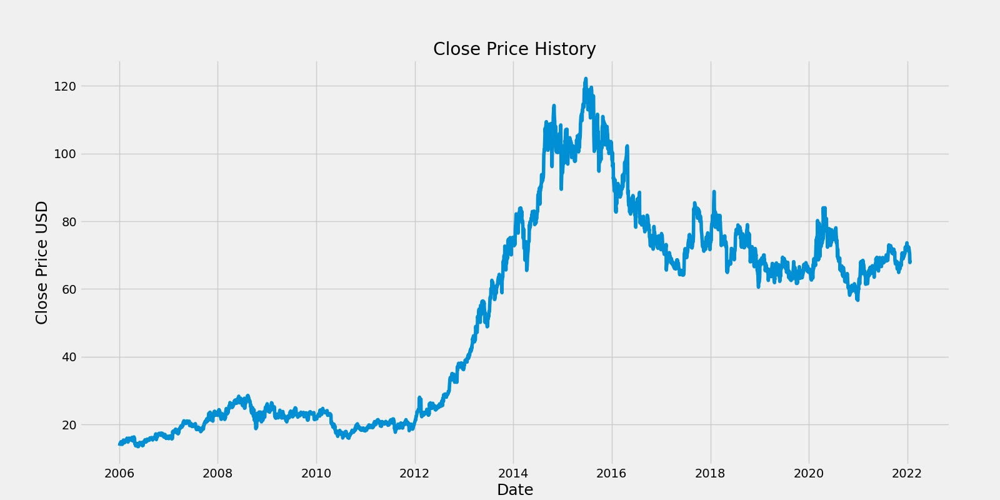
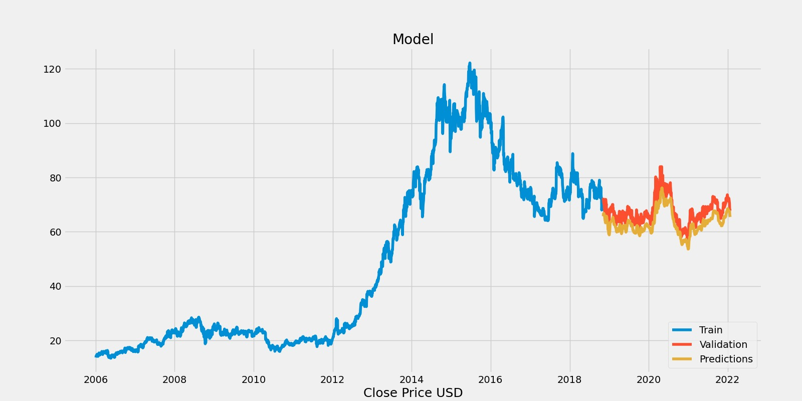
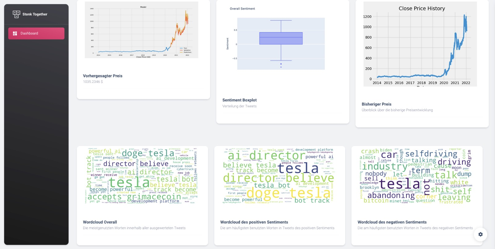

# Stonk2Gether

## Dokumentation
### Disclaimer
Keine Anlageberatung

### Getting Started: 

Folgende Bibliotheken werden benötigt um den Stonk2Gether Code zu starten:
```
pip install numpy

pip install pandas

pip install sklearn.preprocessing

pip install spacy

pip install python-rake

pip install keras

pip install matplotlib

pip install flask
```

# Einleitung

### Team:
Jonas Wuttke, Lukas Bach und Ferdinand Muth

Ein Dashboard, welches das Sentiment zu Unternehmen anzeigt und den Aktienkurs dieser Analysiert und einen Preis für den Nachfolgende Tage verhorsagt.

# Motivation
Spielerische Meinungsbildung und Übersicht über Kurse, allgemeine Themen und Meinungen zu börsennotierten Unternehmen, sowie auf einem Modell basierende Kursvorhersagen.

# Ziel

Schnell und einfach Echtzeit Analysen von Aktienkursen und Sentimenten bekommen.

# Backend

Das Backend läuft über die Flask API. 
Es werden die Code Pipelines der TSA und Sentiment Analyse mithilfe von Inputs im Frontend ausgeführt. 
Dabei kriegt das Backend mithilfe von JavaScript die Daten der Aktien, des Aktienkürzels und die Anzahl der Tweets, die analyisert werden sollen.
Anschließend stellt die Flask API die PNGs der jeweiligen Analysen bereit.

## Wordclouds:





## Time Series Analysis




# Frontend




